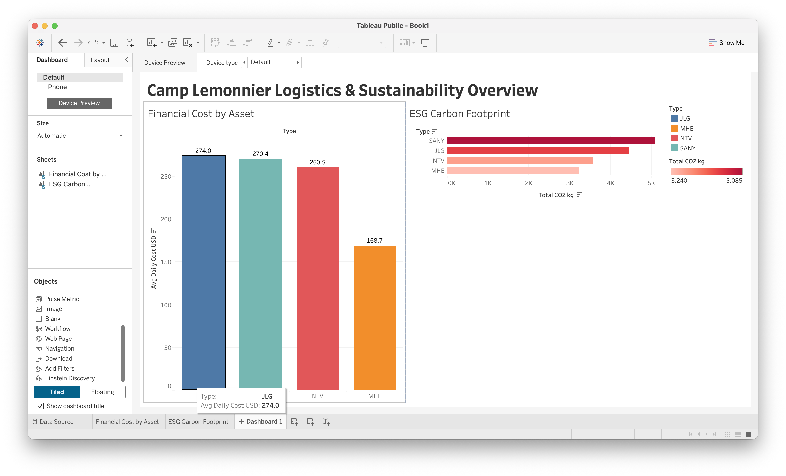

# 🚚 Military Fleet Logistics & ESG Data Pipeline

## 📋 Overview
This repository contains an automated Data Analytics (ETL) pipeline engineered to process raw logistics data for leased vehicle fleets (Camp Lemonnier). It extracts raw lease data, transforms it using Python to aggregate financial costs, and calculates environmental impact based on EPA emission standards.

## 🎯 Business Objectives
1. **Financial Optimization:** Identify high-cost asset categories (MHE vs. NTV vs. Heavy Equipment) to assist logistics leadership in vendor contract renegotiations.
2. **ESG Compliance (Sustainability):** Track daily CO2 emissions across the fleet to highlight prime candidates for electric vehicle (EV) or hybrid transition.

## 💻 Technology Stack
* **Language:** Python 3.x
* **Libraries:** Pandas (Data manipulation, ETL processing)
* **Environment:** Jupyter Notebook / VS Code (.venv)
* **Visualization:** Tableau Public (Dashboards pending in Phase 3)

## 🗂️ File Structure
* `camp_lemonnier.ipynb`: The core Python script containing the data cleaning, grouping, and ESG calculation logic.
* `Camp_Lemonnier_Raw_Data.csv`: The initial, unprocessed mock dataset (provided for reproducibility).
* `Camp_Lemonnier_Cost_Summary.csv`: Automated output detailing average daily lease costs and total fuel consumed by asset type.
* `Camp_Lemonnier_ESG_Report.csv`: Automated output calculating the total carbon footprint (kg CO2) based on EPA diesel multipliers.

## 🚀 Impact
By automating this pipeline, base logistics teams can instantly generate monthly cost and carbon footprint reports without manual spreadsheet data entry, ensuring accuracy and rapid strategic decision-making.

*(Note: Executive Data Visualizations will be added to this repository shortly).*
